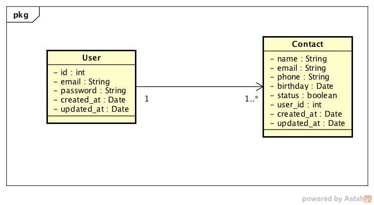

# Agenda Jus
Um escritório de advocacia entrou em contato com o Jus.com.br, perguntando se poderíamos desenvolver uma agenda on-line: onde todos os funcionários autorizados do escritório, podem gerenciar a carteira de clientes da empresa.

## Especificação
Você deve implementar um sistema para gerenciamento de contatos, com as seguintes funcionalidades.
- 1 - Login 
  - Cadastro de usuário
- 2 - Contato 
  - Adicionar
  - Excluir
  - Listar
  - Buscar

## Regra de negócio
- Nenhum contato pode ser removido do banco de dados, apenas desativado.
- Existe 2 (dois) níveis de usuários: super user e user comum. 
- Usuário do tipo `comum`: pode visualizar apenas os contatos que ele mesmo cadastrou.
- Usuário do tipo `admin`: pode visualizar todos os contatos.

## Diagrama de Classe
`O diagrama está incompleto, é apenas uma dica, sinta-se livre =)`
